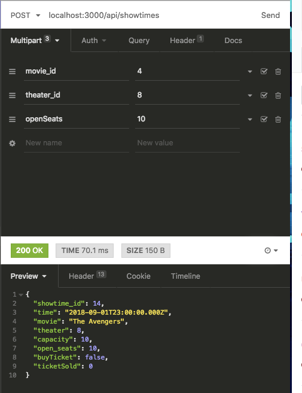

# Lights, Camera, Launchpad!

## One guy's quest to build a somewhat decent Movie Theater App

**Table of Contents**

Prologue

I. Saving Private Ryan's data in the backend

II. A View to A Controller, Model, and Route

III. All Quiet on the Western Frontend

IV. Mission: Impossible (for now)

V. The Terminator

Conclusion

### Prologue

"Please let me know if you have any questions."

"This'll be a walk-in-the-park!" I arrogantly thought to myself after reading the challenge prompt, "I can definitely make all of these actions into a beautiful Movie Theater App! Even though I'm working on my capstone project, I'll whip through this coding challenge before giving my presentation in a few days!"

Little did I know, this project would test everything I've learned from Actualize the past three months and be more difficult and time consuming than my previously overconfident ego imagined. 13 days and well-over six hours of coding later, our app was complete.

### I. Saving Private Ryan's data in the backend

At Actualize, I was taught to always begin a new project by modeling the database schema on an Excel document. It helps to visualize how all the data connects in order to ensure everything saves in the database correctly, especially with has many/belongs to relationships. Mistakes here could spell trouble later, so after modeling the relationships with fake data, I was ready to start coding.

**SCREENSHOT OF EXCEL DOCUMENT**

### II. A View to A Controller, Model, and Route

Database schema in hand, I loaded up a new rails project and initialized it on Github. While testing the simple models, I messed up the naming for "Auditorium", crashing the backend. While I know the correct plural is "Auditoria", I realized I would have to make an adjustment in order to get everything functioning properly. A database migration would be necessary.

Carefully, I replaced the erroneous "Auditorium" model with the s-plural "Theater" model. With the models corrected, I started coding the association-dependent models (Showtime, Ticket). At first, these new models failed to save to the database. After some digging, I learned that rails has a default security measure in place whenever a model contains "belongs_to". Lucky for me, this was an easy fix.

```
class Showtime < ApplicationRecord
  has_many :tickets
  belongs_to :movie, optional: true
  belongs_to :theater, optional: true
end
```

With everything working, I continued fleshing out the models. When attempting to create a new ticket, I realized the tickets weren't saving to the database. Apparently, the default integer data type is too small for a 16 digit credit card number. Another database migration would get our system saving the credit card numbers. Gotta love additional database migration practice!

After testing out CRUD actions with Insomnia and double-checking data storage in Postico, I moved on to validations. While we briefly covered validations at the beginning of classes about two months ago, I didn't know how to properly validate credit card numbers and expiration dates. After some research, I successfully had the credit card validations working below:

```
class User < ApplicationRecord
  validates :first_name, presence: true
  validates :last_name, presence: true
  validates :email, presence: true
  validates :credit_card, presence: true, numericality: true, length: {is: 16}
  validates :cvv, presence: true, numericality: true, length: {in: 3..4}
  # may be prettier way to write this validation
  validates :expiration_date, presence: true,
    :if => :expiration_date_cannot_be_past?
   def expiration_date_cannot_be_past?
    if expiration_date.present? && expiration_date < Date.today
      errors.add(:expiration_date, "Credit card is expired")
    end
  end
   has_many :tickets
end
```

I tested everything with some fake data in Insomnia and everything worked. With a functioning backend, I was ready to make the frontend.



### III. All Quiet on the Western Frontend

After linking the front end to the backend via CORS, I started building out the pages with VueJS and Bootstrap. Read actions were fairly straightforward to display, but my first major roadblock arose with purchasing tickets.

I didn't want to force users to login just to buy a single movie ticket, so I intended for the purchase button to complete two separate post actions: first, create a new user and second, buy the user's ticket. Failing to get everything functioning properly, I hard-coded the user_id and expiration date temporarily, knowing this action would require additional tinkering later on.

```
purchase: function(showtime) {
      // create user
      var params1 = {
        first_name: this.newUser.first_name,
        last_name: this.newUser.last_name,
        email: this.newUser.email,
        credit_card: this.newUser.credit_card,
        cvv: this.newUser.cvv,
        expiration_date: "2020-09-04T20:49:33.050Z"
      };
      axios.post("http://localhost:3000/api/users", params1).then(
        console.log("USER CREATED!"));

      // create ticket
      // going to hard code the user_id for now will come up with better way later
      var params2 = {
        user_id: 2,
        showtime_id: showtime.showtime_id,
        seat: 2
      };
      axios.post("http://localhost:3000/api/tickets", params2).then(
        console.log("TICKET CREATED!"));

      console.log("LET'S GO TO THE MOVIES!");
    }
```

Switching gears, I built out the owner's portal and tested all buttons and forms; keeping an eye out for error messages in either the Chrome Console, Terminal, or Postico. If I didn't see anything, then input went through and saved. But oh, were there error messages!

If coding is The Wizard of Oz, error messages are the Yellow Brick Road. Like Dorothy, I followed the error message whenever something wasn't working (which was often, contrary to what you would believe). After some tinkering, VueJS was working with Rails. Our app was back in action from frontend to backend. Now it was time to attempt e-mail functionality...

### IV. Mission: Impossible (for now)

You know what never gets old? Figuring out an issue on your own, especially after looking it up on Stackoverflow. I dug myself out of a jam a few times on the backend and felt ready to do the same with e-mail functionality. How hard can it be to look something up, read the docs, and successfully implement it?

**_screenshot of rails email docs_**

Well shoot, the code from the rails docs weren't working on my end.

**_aspiringwebdev.com screenshot_**

Trying with a mailchimp account yielded no luck either.

**\*medium.com screenshot\*\***

Unfortunately, this well-written medium post on the subject also failed to properly send the e-mail.

After some serious error-message deciphering, I could get the e-mail model to save in the database, however, the e-mail failed to send from both, a mailchimp account and my personal e-mail.

**_screenshot from postico_**

While I couldn't get the message to send, I at least had these two takeaways:

1. Generating a scaffold is a very efficient way to build models, controllers, and views. Not going to lie, I kinda wish I knew this before starting the project

2. I had to lower my gmail security for a bit during that e-mail adventure, so if I ever get hacked in the future, I'll know exactly why...

Humbled, I decided to make progress on something else instead.

### V. The Terminator

I'll be back... to change my JSON views with a partial

```
json.first_name ticket.user.first_name
json.last_name ticket.user.last_name
json.showtime_id ticket.showtime_id
json.movie ticket.showtime.movie.name
json.time ticket.showtime.time
json.theater ticket.showtime.theater_id
json.seat ticket.seat
```

Now the \_model file ensures I only have to change JSON views once. #DRY

CONCLUSION
-enjoyed the project
-applied everything from class
-understand concepts we didn't initially grasp
-I know someone who may be interested in using this app (moviepass)
